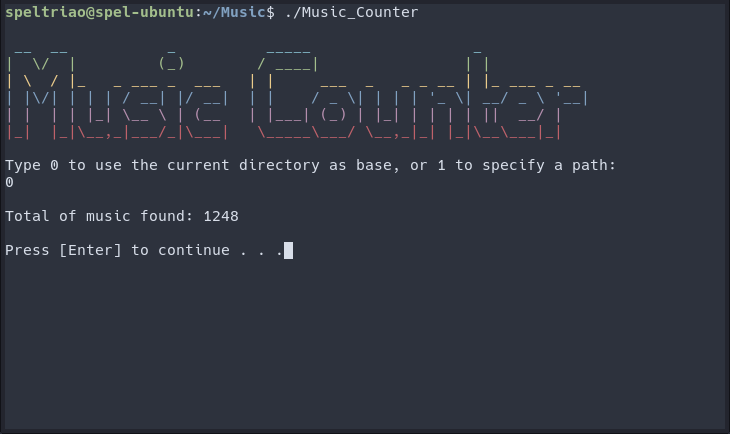

# Music-Counter
<b>Fast C program for counting music files</b>

->Music formats supported: MP3,WMA, WAV, FlAC, M4A, AAC, OGG.

->Search all base directories, all its subdirectories and files, recursively. 

  
<b>USAGE EXAMPLE:</b>

<i> Example Directory: /home/USER/Music </i>

<b>0-)</b> Type 0 to use the current directory as base for the counter.

<b>1-)</b> Type 1 to specify a custom path as base for the counter.

  

<b>SCREENSHOTS:</b> 

<b>0-)<i>Using the current directory as base</i></b>:
  

  
<b>1-)<i>Setting a custom directory as base</i></b>:
  

  
<b>DOWNLOAD THE PROGRAM:</b>

https://github.com/speltriao/Music-Counter/releases

