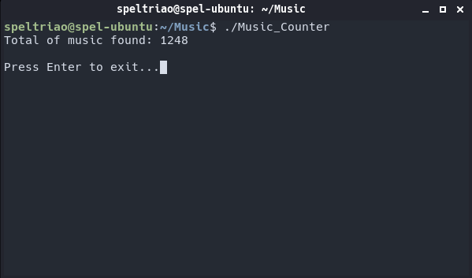

# Music-Counter
<b>C program for counting music files in all directories and subdirectories.</b>

->Music formats supported: MP3,WMA, WAV, FlAC, M4A, AAC, OGG.
->Search starts on the directory that the program is and expands to all its subdirectories. 

USAGE EXAMPLE:
<i> Example Directory: /home/USER/Music </i>
1-) If the program is at "Music" folder, it will count only the music from the "Music" folder and all folders inside it.
2-) If the program is at /, it will search the whole disk for musics.

