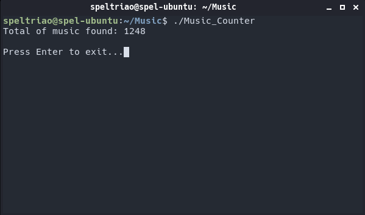

# Music-Counter
<b>Fast C program for counting music files</b>

->Music formats supported: MP3,WMA, WAV, FlAC, M4A, AAC, OGG.

->Search starts on the directory that the program is and expands to all its subdirectories recursively. 

  
<b>USAGE EXAMPLE:</b>

<i> Example Directory: /home/USER/Music </i>

<b>1-)</b> If the program is at "Music" folder, it will count only the music from the "Music" folder and all folders inside it.

<b>2-)</b> If the program is at /, it will search the whole disk for musics.

  
<b>SCREENSHOT</b> <i>(As in Example 1)</i>

